# SmartCattle Frontend

Web interface for **SmartCattle**, a platform that monitors cattle farms with cameras and computer vision. Farm owners and workers use it to see what is happening on the farm, receive alerts when an animal leaves its safe zone or a person appears where they should not, and review what happened afterwards.

This repository contains only the frontend. The REST API lives in the separate `SmartCattle-Backend` repository (Python, FastAPI), and detection (OpenCV + YOLO) belongs to `SmartCattle-AI`.

> **Status:** Phases 1–5 are complete: foundation, authentication, dashboard, live monitoring and cameras. The cattle, events, security and settings screens are placeholders that later phases will replace. See [Roadmap](#roadmap).

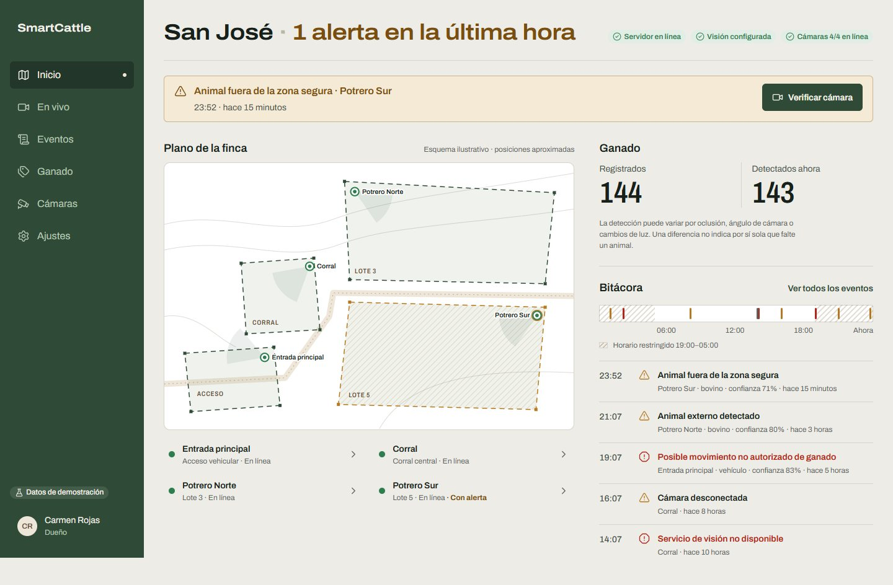

| Login (desktop) | Login (mobile) |
|---|---|
| 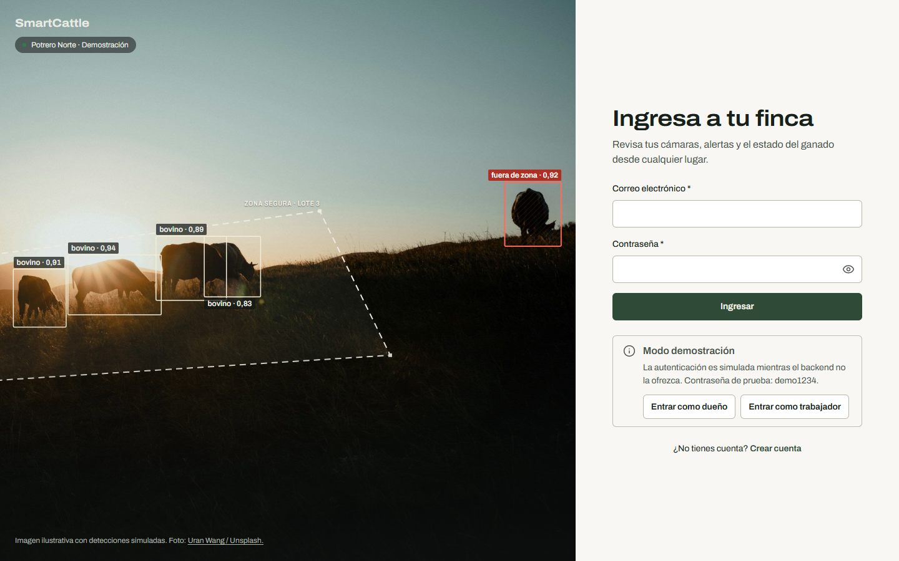 | 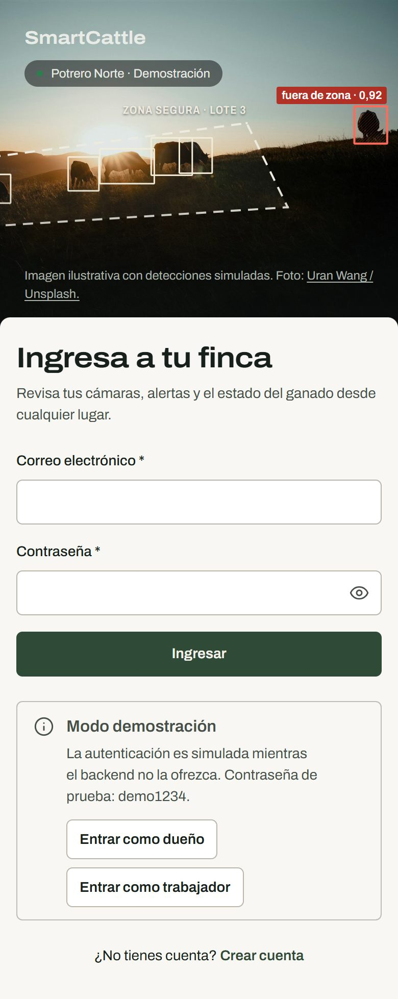 |

| App shell (desktop) | App shell (mobile, "Más" sheet) |
|---|---|
| 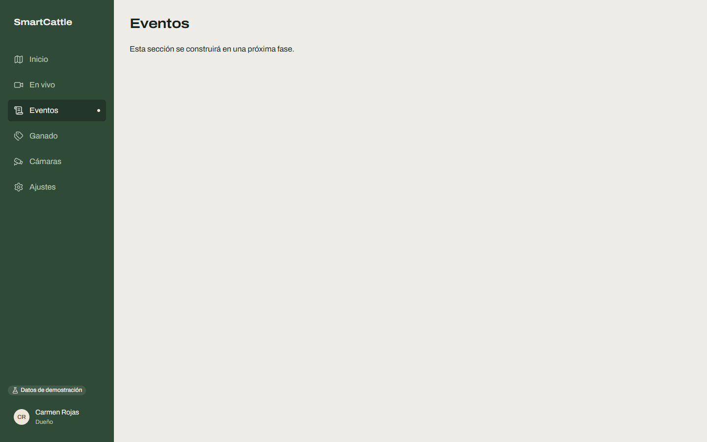 | 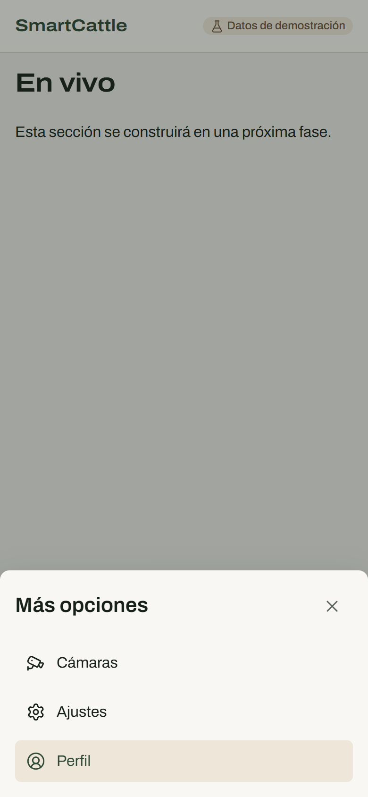 |

---

## Contents

- [Technology stack](#technology-stack)
- [Getting started](#getting-started)
- [Environment variables](#environment-variables)
- [Architecture](#architecture)
- [Backend connection](#backend-connection)
- [Data sources and mock data](#data-sources-and-mock-data)
- [Authentication](#authentication)
- [Routing and navigation](#routing-and-navigation)
- [Dashboard](#dashboard)
- [Live monitoring](#live-monitoring)
- [Design system](#design-system)
- [Accessibility](#accessibility)
- [Testing and quality checks](#testing-and-quality-checks)
- [Implemented features](#implemented-features)
- [Roadmap](#roadmap)
- [Credits](#credits)

---

## Technology stack

| Area | Choice | Why |
|---|---|---|
| UI | React 19 | Component model, large ecosystem |
| Language | TypeScript 6 (strict) | Typed API contracts and safer refactors |
| Build tool | Vite 8 | Fast dev server, CSS Modules out of the box |
| Routing | React Router 8 | Data router with nested layout routes |
| Styling | Plain CSS: CSS Modules + custom properties | No framework lock-in, tokens in one file |
| Icons | lucide-react | Consistent stroke icons, tree-shaken |
| Font | Archivo Variable (self-hosted via Fontsource) | One family with a width axis for hierarchy |
| Tests | Vitest | Same config as Vite, fast |
| Lint | ESLint 10 + typescript-eslint | Flat config |

No UI kit, CSS framework or state library is used. Server state will be added with a query library when the dashboard needs polling.

## Getting started

Requirements: Node.js 20.19+, 22.13+ or 24+ (required by Vite 8 and ESLint 10) and npm.

```sh
npm install
cp .env.example .env   # PowerShell: Copy-Item .env.example .env
npm run dev            # http://localhost:5173
```

| Command | What it does |
|---|---|
| `npm run dev` | Start the Vite dev server with hot reload |
| `npm run build` | Type-check (`tsc -b`) and build to `dist/` |
| `npm run preview` | Serve the production build locally |
| `npm run lint` | Run ESLint |
| `npm test` | Run the Vitest suite once |

In development, a component gallery is available at `/dev/ui`. It is excluded from production builds.

## Environment variables

Copy `.env.example` to `.env`. Never commit `.env`.

| Variable | Default | Purpose |
|---|---|---|
| `VITE_API_BASE_URL` | `http://localhost:8000` | Base URL of the SmartCattle FastAPI backend. Trailing slashes are removed. |
| `VITE_DATA_SOURCE` | `mock` | `api`, `mock` or `hybrid`. See [Data sources](#data-sources-and-mock-data). Invalid values fall back to `mock`. |

The frontend holds no secrets. Do not put API keys in `VITE_*` variables: they are embedded in the client bundle.

---

## Architecture

### System context

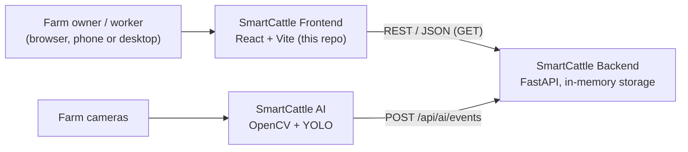

The frontend only reads from the backend. It never calls the AI service directly and never posts AI events.

### Frontend layers

UI components never call `fetch`. Every request goes through one HTTP client and a typed service layer, and every screen receives data together with its origin (`api`, `mock` or `unavailable`).

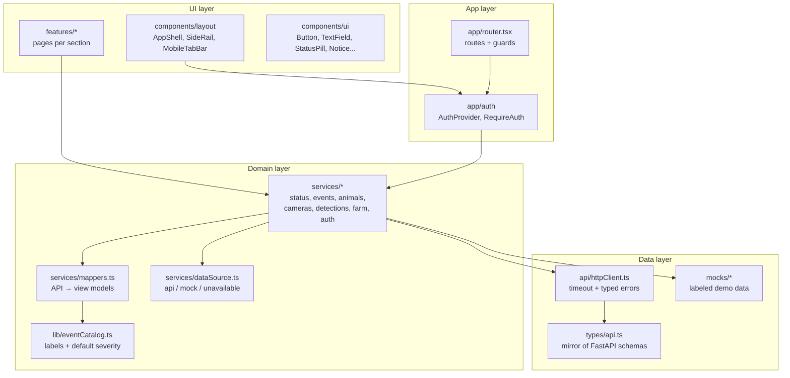

### Folder structure

```text
src/
  api/          HTTP client, configuration, typed errors
  app/          App root, router, navigation config, auth context and guards
  assets/       Images (login photo, with embedded provenance)
  components/
    layout/     AppShell, SideRail, TopBar, MobileTabBar, MoreSheet
    ui/         Reusable UI primitives
  features/     One folder per section (auth, dashboard, monitoring, events, ...)
  lib/          Pure helpers: event catalog, permissions, safe storage
  mocks/        The only place with fictional data (clearly labeled)
  services/     Data access per capability, mappers, source resolution
  styles/       Design tokens, base styles, reduced-motion rules
  types/        API contract mirror, domain view models, auth types
docs/
  screenshots/  Images used in this README
```

Tests live next to the code they cover (`*.test.ts`).

---

## Backend connection

The backend (`SmartCattle-Backend`) is a FastAPI service with in-memory storage. These are the **only** endpoints that exist today, and the only ones the frontend calls:

| Method | Path | Response | Used for |
|---|---|---|---|
| GET | `/health` | `{ "status": "ok" }` | Backend online/offline indicator |
| GET | `/api/status` | `version`, `ai_service.configured`, `storage` | System status. `configured` means an AI URL is set, **not** that the AI is online. |
| GET | `/api/animals` | `{ items: [], total: 0 }` (always empty today) | Registered cattle count |
| GET | `/api/events` | Latest 1000 events, newest first | Alerts and history |
| POST | `/api/ai/events` | — | AI service only. **The frontend never calls it.** |

Event shape (mirrored in `src/types/api.ts`):

```json
{
  "id": "uuid",
  "event_type": "cattle_out_of_zone",
  "camera_id": "camera-01",
  "detected_object": "cow",
  "confidence": 0.95,
  "timestamp": "2026-10-03T15:30:00Z",
  "received_at": "2026-10-03T15:30:01Z"
}
```

The backend's CORS policy allows `GET` and `POST`, the headers `Content-Type` and `X-API-Key`, and no credentials. Real authentication will need a CORS change on the backend (an `Authorization` header or credentials).

### What the backend does not provide yet

The frontend never invents endpoints. Until these capabilities exist, the UI uses labeled demo data or shows that the capability is unavailable:

- Authentication, sessions, users, roles, farms and worker invitations
- Camera list and status, video streaming, per-frame detections
- Safe-zone geometry
- Person or vehicle detection, day/night security rules
- Event severity, zone, evidence and review state
- Real-time push (WebSocket/SSE) and notifications

---

## Data sources and mock data

`VITE_DATA_SOURCE` decides where each capability gets its data. Capabilities the backend supports are `backend`; the rest are `mock-only`.

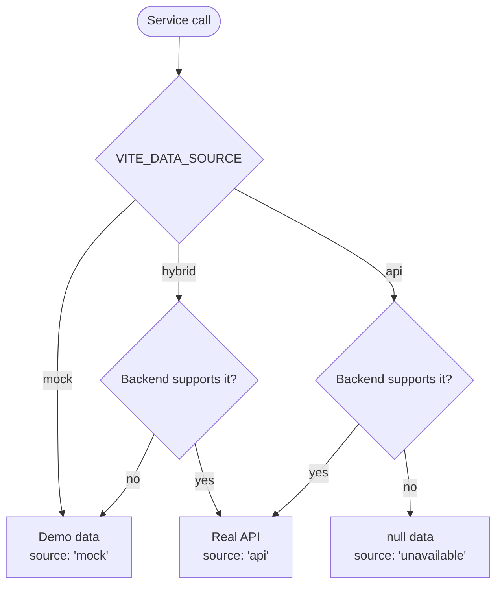

| Capability | `mock` | `hybrid` | `api` |
|---|---|---|---|
| System status, events, registered cattle | demo | **API** | **API** |
| Cameras, detections, safe zones, detected count, farm | demo | demo | unavailable |
| Authentication | demo | demo | unavailable |

Rules:

- All fictional data lives in `src/mocks/` and starts with a `DEVELOPMENT MOCK DATA` header.
- Every service returns `{ data, source }`. When anything on screen comes from demo data, the UI shows a **"Datos de demostración"** badge.
- Demo detections are deterministic (seeded per camera) so screenshots and tests are stable.
- Event kinds that the backend does not emit yet (`person_detected`, `possible_intrusion`, ...) exist only in demo data.

### Event language

`src/lib/eventCatalog.ts` maps each event kind to a Spanish label, a category and a default severity. Object detection cannot know intent, so the UI never says "thief" or "robbery":

| Kind | Label (UI) | Category | Default severity |
|---|---|---|---|
| `cattle_out_of_zone` | Animal fuera de la zona segura | cattle | warning |
| `person_detected` | Persona detectada | security | info |
| `possible_intrusion` | Posible intrusión | security | critical |
| `external_animal_detected` | Animal externo detectado | cattle | warning |
| `possible_unauthorized_movement` | Posible movimiento no autorizado de ganado | security | critical |
| `camera_disconnected` | Cámara desconectada | system | warning |
| `ai_unavailable` | Servicio de visión no disponible | system | critical |

Severity from the catalog is a presentation default (`severitySource: 'catalog'`). When the backend sends severity (for example, a night-time rule), it takes precedence (`severitySource: 'backend'`).

---

## Authentication

The backend has no authentication yet, so login and registration run against a **demo service** behind the `AuthService` interface. Replacing it with a real implementation does not touch the screens.

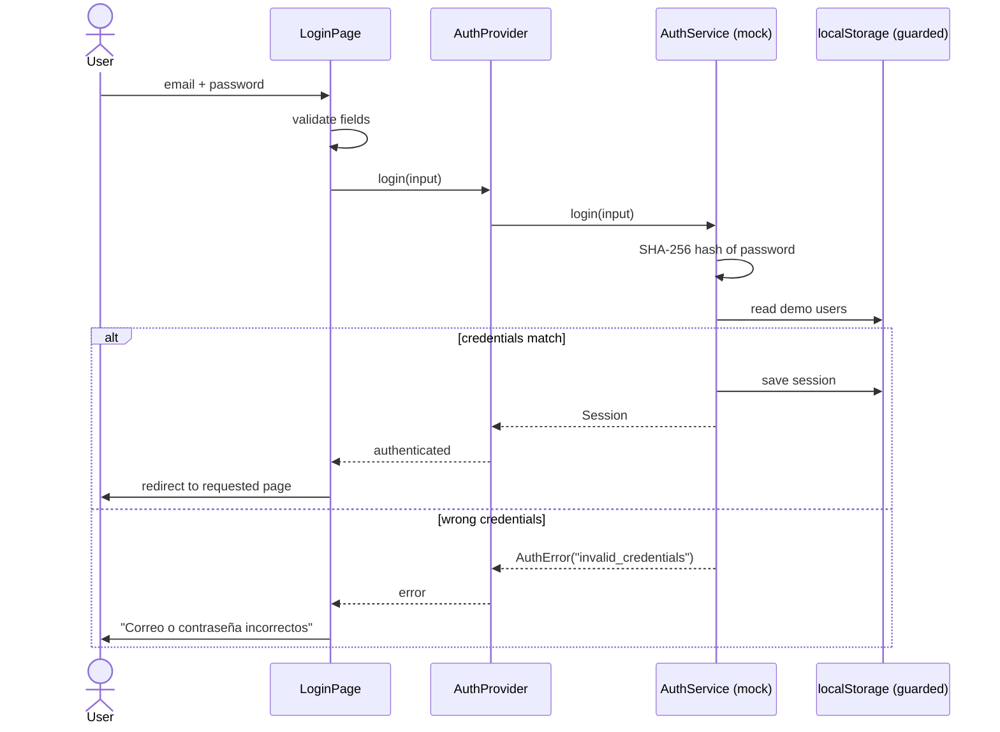

- **Demo accounts** (password `demo1234`): `dueno@sanjose.demo` (owner) and `trabajador@sanjose.demo` (worker). The login page has buttons that fill them in.
- Registration always creates an **owner**. Workers will join through an invitation from the owner, which needs backend support.
- Passwords are stored as SHA-256 hashes, never in plain text. All storage access is wrapped in `try/catch` and falls back to memory.
- In `api` mode the login shows "Inicio de sesión no disponible" instead of pretending to work.
- Route guards and permissions (`src/lib/permissions.ts`) only shape the UI. **The backend must enforce access.**

| Permission | Owner | Worker |
|---|---|---|
| `monitoring:view`, `events:view`, `events:review` | yes | yes |
| `farm:edit`, `workers:manage`, `cameras:configure`, `alerts:configure`, `security-hours:configure` | yes | no |

---

## Routing and navigation

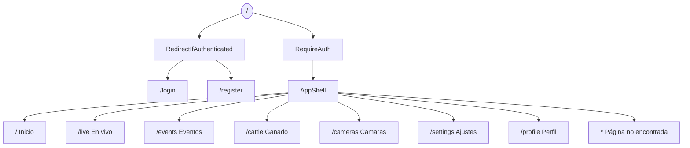

- Anonymous visitors to a private route are redirected to `/login` and come back to the requested page after signing in.
- The navigation is defined once in `src/app/navigation.ts`.
- **Desktop (≥ 1024 px):** fixed farm-green side rail with the six sections, the demo badge and the signed-in user.
- **Mobile:** top bar, a five-cell bottom tab bar (Inicio, En vivo, Eventos, Ganado, Más) and a native `<dialog>` sheet for Cámaras, Ajustes and Perfil.
- "Security" is a tab inside Events rather than a separate page: security alerts are events, and a separate page would duplicate the list and filters.

---

## Dashboard

The dashboard answers "is everything OK on the farm right now?" first, then where and what happened.

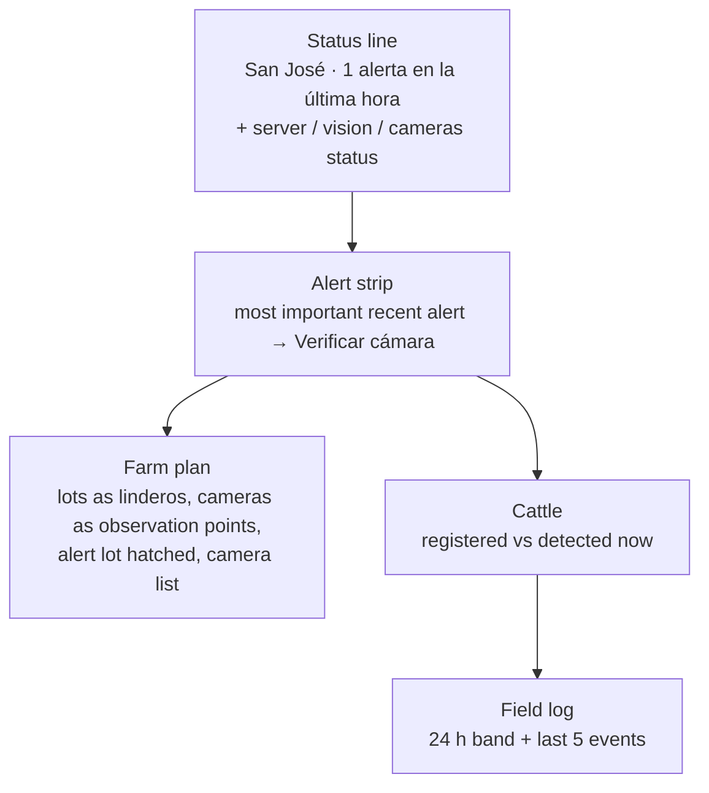

| Block | Source today | Notes |
|---|---|---|
| Server status | `GET /health`, `GET /api/status` | "Visión configurada" only means an AI URL is set |
| Events, alert strip, field log | `GET /api/events` (demo in `mock` mode) | Polled every 15 s |
| Registered cattle | `GET /api/animals` | Shows "Sin registros" while the backend list is empty |
| Detected now, cameras, farm plan, restricted hours | demo data | The plan is labeled "Esquema ilustrativo" |

Rules the dashboard follows:

- **"Active" alerts.** The backend has no review state, so the dashboard shows warning and critical events from the **last hour** and says so ("1 alerta en la última hora").
- **Never "all clear" without data.** If events fail to load or the server is offline, the headline reads **"Estado desconocido"**, not "Todo en orden".
- **Registered ≠ detected.** The two numbers are shown side by side with a note that occlusion, camera angle or lighting can lower the detected count.
- **Stale data stays visible.** A failed background refresh keeps the last data and shows the offline notice. Retries are automatic.
- **Time to scale.** The 24 h band places each event at its real time and shades the restricted hours.

| Server offline (hybrid mode) |
|---|
| 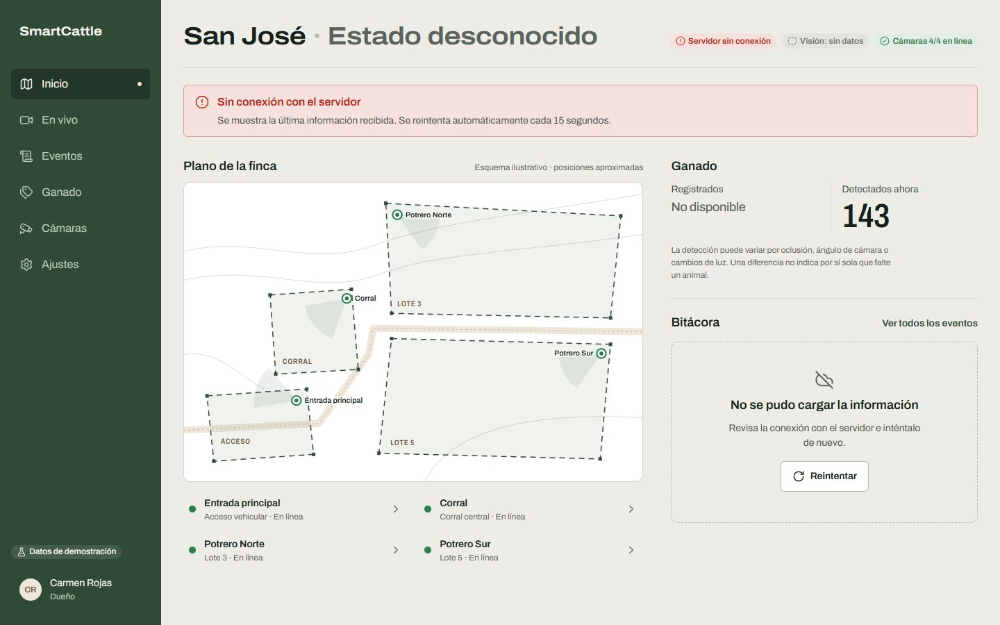 |

---

## Live monitoring

`/live?camera=<id>` shows one camera as the protagonist. Without a `camera` parameter it opens the camera with the most recent alert, so "Verificar cámara" on the dashboard lands on the evidence.

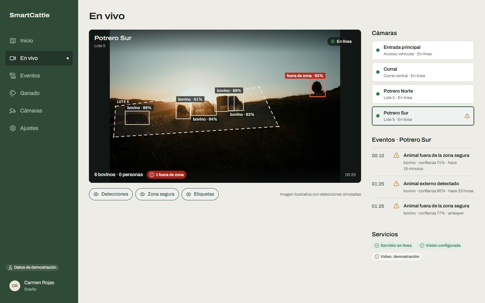

The camera stage stacks independent layers over the picture. Overlay coordinates are normalized (0–1) and drawn in the picture's own pixel space, so boxes stay registered to the image at any size.

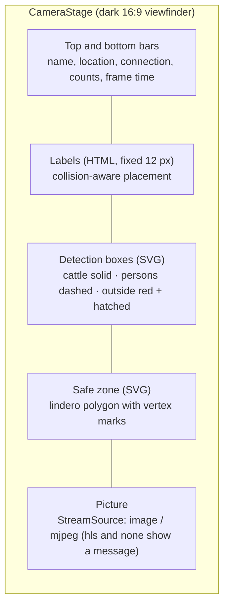

| Stage state | When | What the user sees |
|---|---|---|
| Loading / connecting | Camera or stream loading, or camera reports `connecting` | Spinner and text |
| Live | `image` or `mjpeg` source | Picture with overlays, counts, layer toggles |
| No stream | Source `none` (every camera except the demo one today) | "Sin transmisión disponible" |
| Unsupported | Source `hls` (no player bundled yet) | "Formato de video no compatible" |
| Offline / error | Camera status | Message, plus last signal time when offline |
| Vision not configured | `ai_service.configured = false` | Warning notice; counts say there are no detections |
| Server offline | `/health` fails | Critical notice; data refresh retries automatically |

- **Demo picture.** No camera streams exist yet. The south pasture camera shows the illustrative dusk photo with hand-placed detections (one animal outside the zone), labeled "Imagen ilustrativa con detecciones simuladas".
- **Polygon zones.** A safe zone may carry an `outline` polygon; zone membership then uses the polygon (bottom-center of each box, the same anchor as the prototype rule) instead of the bounding box.
- **Layer toggles** (Detecciones, Zona segura, Etiquetas) only change the display. They never touch backend data.
- **Polling:** detections every 5 s, cameras, events and status every 15 s. Changing camera never shows the previous camera's data.
- **Mobile:** the camera strip scrolls horizontally and keeps the selected camera in view; persons and outside-zone labels stay, other labels hide on narrow screens to avoid clutter.

| No stream |
|---|
| 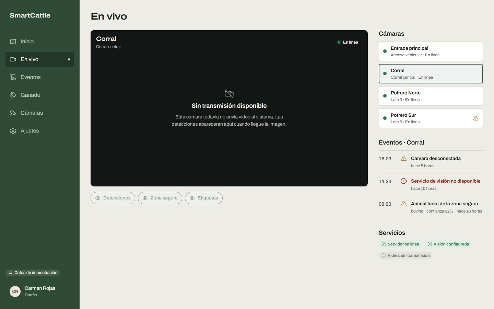 |

---

## Design system

The visual direction is **"farm survey plan"**: safe zones are drawn as survey boundaries (*linderos*, dashed lines with vertex marks), cameras are observation points and the history reads as a field log. It deliberately avoids generic grey KPI-card dashboards and cartoon farm imagery.

All values live as CSS custom properties in `src/styles/tokens.css`. Components use tokens only.

| Role | Token | Value |
|---|---|---|
| Ground | `--color-ground` | `#EDECE6` |
| Surface | `--color-surface` | `#F8F7F3` |
| Ink | `--color-ink` | `#17201A` |
| Brand (rail, primary action) | `--color-brand` | `#2F4A36` |
| Earth (selection, accents) | `--color-earth` | `#8A6A4A` |
| Safe / connected | `--color-safe` | `#2E7D4F` |
| Warning | `--color-warning` | `#B7791F` |
| Critical | `--color-critical` | `#B42318` |
| Inactive / disconnected | `--color-inactive` | `#6F756F` |
| Camera stage | `--color-stage` | `#121614` |

- **Light app, dark camera stage.** Owners check the app outdoors in daylight, so the app is light; video sits on a dark viewfinder surface.
- **Typography:** Archivo Variable. The wide cut is for headings, the condensed cut for dense labels, with tabular figures for counts and times.
- **States** always combine an icon and a word, never color alone. Outside-zone areas are also hatched.
- **Motion:** short ease-out transitions (140–600 ms) and one authored moment per screen (on the login, the safe zone draws in and the detections appear one by one). Everything respects `prefers-reduced-motion`.
- Text selection, focus rings, the caret and scrollbars are themed from the palette.

## Accessibility

- Semantic landmarks, a "Saltar al contenido" skip link and one `h1` per page
- Visible focus ring on every interactive element
- Labels linked to inputs, `aria-invalid` and `aria-describedby` for errors and hints, focus moved to the first invalid field
- Touch targets of at least 44 px, 16 px inputs (no zoom on iOS), safe-area insets
- Status never conveyed by color alone
- `prefers-reduced-motion` disables decorative motion

## Testing and quality checks

```sh
npm test        # 108 tests
npm run lint
npm run build
```

Covered: configuration parsing, the HTTP client (success, HTTP error, network, timeout, invalid JSON), mappers, data-source resolution, every service in `api` and `mock` mode, the demo auth service, permissions, safe storage, form validation, date and number formatting, and the dashboard rules (recent alerts, unknown state, 24 h band positions and restricted hours across midnight).

Each change is also reviewed with desktop (1440 px) and mobile (390 px) screenshots and an automated design detector before it is committed.

---

## Implemented features

**Phase 1: Foundation**
- Vite + React + strict TypeScript project, ESLint, Vitest, `@/` alias
- Typed API client, data services, source resolution and centralized demo data
- Design tokens, self-hosted variable font, base styles and reduced-motion rules
- Responsive app shell: side rail (desktop), tab bar and sheet (mobile), route transitions
- Base components: Button, TextField (with password reveal), StatusPill, Notice, EmptyState, ErrorState, Skeleton
- Favicon (a *lindero* mark) and mobile meta tags

**Phase 2: Authentication**
- Login and registration on a real dusk pasture photo with a safe-zone overlay and simulated detections, including one outside the zone
- Field validation, error and loading states, demo-account shortcuts
- Demo auth service with owner and worker roles, session persistence, route guards
- Signed-in user in the rail and logout from the profile page

**Phase 3: Dashboard**
- Status line with the farm name and condition, plus server, vision and camera status
- Recent-alert strip with a direct link to verify the camera
- Schematic farm plan: lots drawn as linderos, cameras as observation points with view wedges, the alert lot hatched, a pulse on the alert camera and a camera list
- Registered vs. detected cattle with the occlusion note
- Field log over a true-scale 24 h band with restricted hours
- Loading, empty, error, offline and unknown states

**Phase 4: Live monitoring**
- Camera stage with picture, lindero safe zone and detection boxes registered to the image
- Distinct strokes for cattle, persons and outside-zone detections; collision-aware labels
- Layer toggles, detection counts and an outside-zone chip
- Camera switcher (side list on desktop, scrollable strip on mobile), per-camera events and service status
- Designed states: loading, connecting, live, no stream, unsupported format, offline, error, vision not configured, server offline

**Phase 5: Cameras**
- One card per camera (cameras are real objects, so they get cards): picture or a short placeholder, status, zone, last connection, detection counts, "Ver en vivo"
- Cameras with recent alerts first, then cameras with connection problems
- Owners see a note that adding or rezoning cameras needs backend support; no fake configuration controls

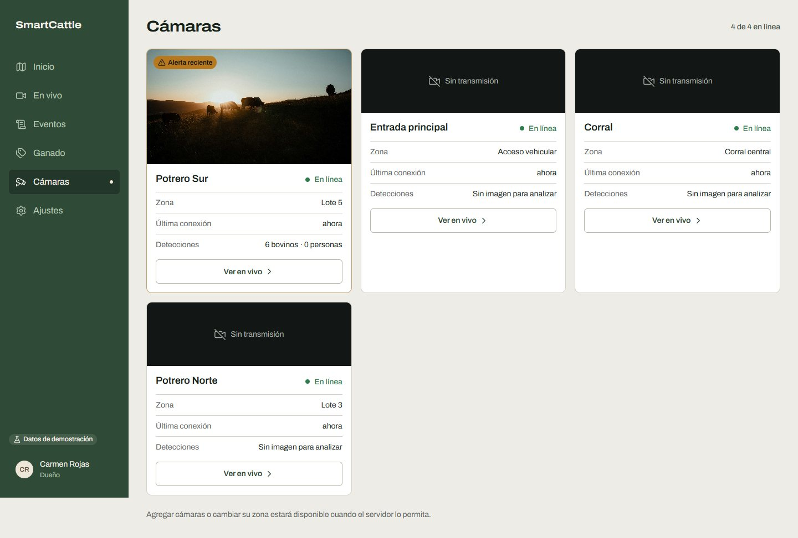

## Roadmap

| Phase | Scope | Status |
|---|---|---|
| 1 | Foundation | Done |
| 2 | Authentication | Done |
| 3 | Dashboard: farm status line, farm plan with cameras and safe zones, registered vs. detected cattle, field log with 24 h band | Done |
| 4 | Live monitoring: camera stage, detection and safe-zone overlays, status panels, all connection states | Done |
| 5 | Cameras: list, states, live access | Done |
| 6 | Cattle: registered vs. detected, recent detections, zone states | Next |
| 7 | Events & alerts: history, filters, detail with evidence | Pending |
| 8 | Security: person detection, possible intrusion, restricted hours | Pending |
| 9 | Settings: farm, users, cameras, alerts, account (permission-aware) | Pending |
| 10 | Quality: accessibility and responsive audit, motion review, `DESIGN.md` | Pending |

Pending on the backend side: authentication, cameras, streaming, detections, safe zones, severity and notifications. The frontend is ready to switch each capability from demo data to the API as it lands.

## Credits

- Login photo: [Cows grazing in a field at sunset](https://unsplash.com/photos/cows-grazing-in-a-field-at-sunset-HaSohIaDVdI) by Uran Wang, [Unsplash License](https://unsplash.com/license). Used as an illustrative image, not farm footage. The detections drawn over it are simulated.
- Icons: [Lucide](https://lucide.dev) (ISC License).
- Font: [Archivo](https://fonts.google.com/specimen/Archivo) by Omnibus-Type (SIL Open Font License).
